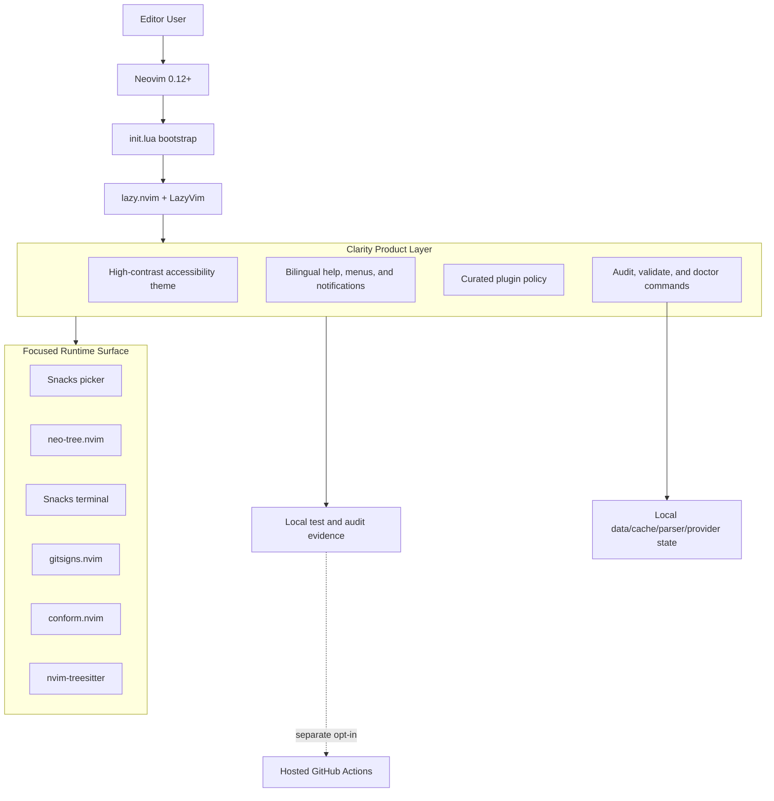
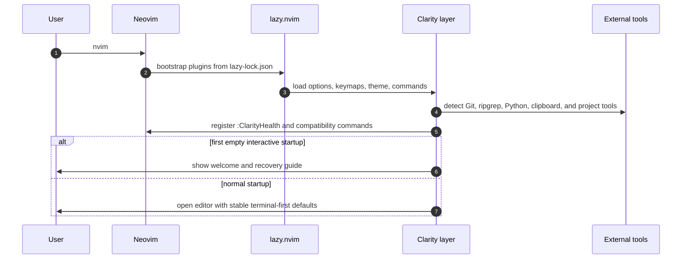
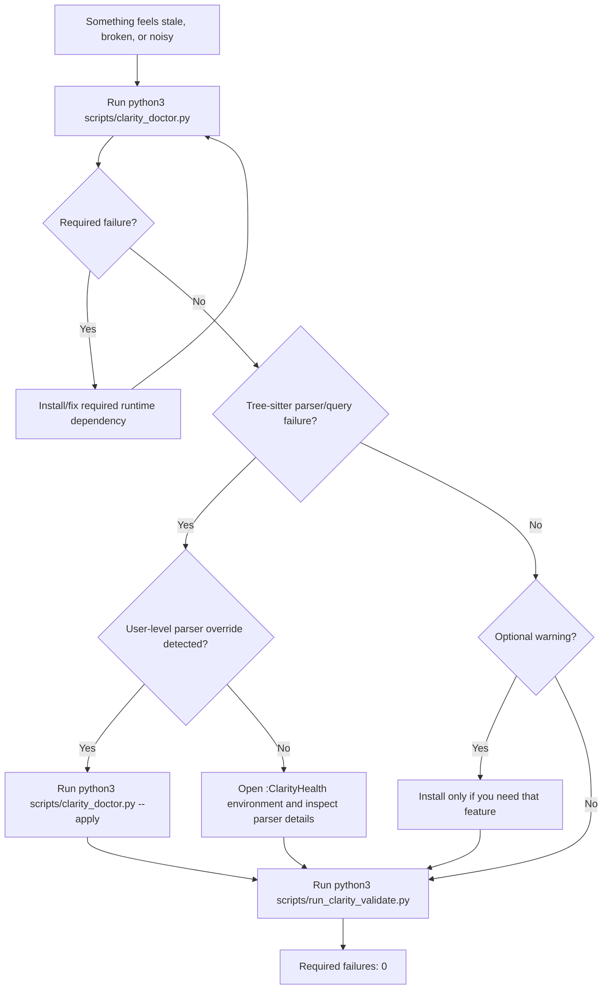

# clarity_lazyvim

<p align="center">
  
</p>

<p align="center">
  <a href="https://github.com/Nongfsq/clarity_lazyvim/actions/workflows/clarity-validate.yml">
    
  </a>
  
  
  
  <a href="LICENSE">
    
  </a>
</p>

<p align="center">
  An accessibility-first, high-contrast, product-shaped Neovim distribution built on <a href="https://www.lazyvim.org/">LazyVim</a>.
</p>

<p align="center">
  Designed for people who want the speed of Neovim without the usual plugin sprawl, shell coupling, or "I updated it and nothing changed" confusion.
</p>

## Why Clarity

Most personal Neovim repos are powerful but hard to trust.

`clarity_lazyvim` takes a different position:

- readability is a product feature, not a theme afterthought
- one recommended path is better than five clever ones
- optional tools stay optional
- Windows + WSL workflows should be explicit, not tribal knowledge
- validation matters as much as visual polish

This repo is not an `oh-my-zsh` bundle, not a shell framework, and not a maximalist plugin showcase.
It is a focused editor product for daily work.

## What You Get

| Area | Primary path | Why it matters |
| --- | --- | --- |
| File search | `<leader>ff` | Fast project entry without depending on file trees for everything |
| Text search | `<leader>fw` | One obvious search path backed by Snacks picker |
| Code folding | `<leader>cz` | Toggle the fold containing the cursor without memorizing Vim's `z` commands |
| Line wrapping | `<leader>uw` | Long lines wrap visually by default; toggle per editing window |
| Terminal | `<leader>tf` | Reliable integrated terminal workflow inside the editor |
| Git review | `<leader>gs`, `<leader>gd`, `<leader>gl`, `<leader>gt`, `<leader>gb` | Read-only status, changes, history, branch graph, and line provenance |
| Git hunks | `[h`, `]h`, `<leader>ghp` | Navigate and preview tracked changes without staging or resetting them |
| Recovery | `:ClarityHealth`, `<leader>hh` | One product-level help, health, and recovery entry |
| Language | `:ClarityLanguage` | Switch Clarity-owned UI between `auto`, `en`, and `zh` |
| Diagnostics | `:ClarityHealth` | Overview, recovery, messages, structured events, clipboard, environment, and language routes |

## Product Highlights

### Accessibility-first visual system

The custom theme is built around strong contrast, clearer syntax separation, and better readability for red-green colorblind users.

### Curated plugin surface

The active stack stays intentionally small:

- LazyVim core
- Snacks picker and floating terminal
- `neo-tree.nvim`
- `gitsigns.nvim`
- `conform.nvim`
- `nvim-treesitter`

Several inherited or optional power-user plugins are deliberately disabled to keep the public product easier to audit and maintain.

### First-run guidance that actually helps

The first empty interactive startup opens a welcome guide automatically once per onboarding version.
It teaches the top actions, points users to clipboard help, and explains how to recover from stale configs.

### Bilingual runtime with English source governance

Clarity now separates maintainer surfaces from product surfaces on purpose:

- source comments stay English-only for long-term maintainability
- Clarity-owned runtime UI can render in English or Chinese
- the locale is controlled with `:ClarityLanguage auto|en|zh`

Live language changes refresh Clarity's global and contextual `which-key`
descriptions, Neo-tree, active/future Snacks pickers, dashboard, and open Health
view without recreating action callbacks. Upstream prose outside Clarity-owned
surfaces remains upstream-owned.

### Terminal-first stability defaults

Clarity now prefers a steadier terminal experience over extra motion or decorative status rendering:

- faster leader-menu response with a lower `timeoutlen`
- no smooth scrolling in terminal workflows
- no invisible-character markers by default
- no custom `statuscolumn` in normal editing buffers
- no indent or scope guide bars in normal editing buffers by default

The goal is simple: typing, vertical movement, and window motion should feel stable before they feel fancy.

### Windows + WSL workflow discipline

The project targets and documents a simple operational rule:

1. Windows repo is the source of truth for edits, commits, and pushes.
2. WSL repo is the runtime mirror.
3. If WSL behavior looks old, compare `HEAD` before debugging anything else.

### Built-in trust layer

This repo ships with:

- `:ClarityHealth` and stable machine-readable audit/validation commands
- headless validation scripts
- isolated natural-lifecycle, fault, and release harnesses
- a GitHub Actions workflow whose runs require separate authorization/evidence

That makes the project feel more like a product than a bag of config files.

## Quick Start

### Windows

Clone into `%LOCALAPPDATA%\nvim`:

```powershell
git clone https://github.com/Nongfsq/clarity_lazyvim.git $env:LOCALAPPDATA\nvim
```

### Linux / WSL / macOS

Clone into `~/.config/nvim`:

```sh
git clone https://github.com/Nongfsq/clarity_lazyvim.git ~/.config/nvim
```

### First launch

```sh
nvim
```

On first launch:

1. `lazy.nvim` bootstraps plugins.
2. Clarity starts without background language-tool or parser installation;
   project environments and agents own their toolchains.
3. The Clarity welcome panel appears automatically on the first empty interactive startup.
4. Use `:ClarityHealth` or `<leader>hh` for help, health, and recovery.
5. Use `:ClarityLanguage auto|en|zh` to inspect or change the Clarity UI language.

## First 5 Minutes

If you only remember one workflow, remember this:

1. Press `Space` and pause to open `which-key`.
2. Use `<leader>ff` to find files.
3. Use `<leader>fw` to search project text.
4. Use `<leader>e` when you want the file tree.
5. Use `<leader>tf` for the floating terminal.
6. Use `gd`/`gr` for code navigation and `[d`/`]d` for diagnostics.
7. Reopen help any time with `:ClarityHealth` or `<leader>hh`.

While editing, use `<leader>cz` to toggle the current code fold and `<leader>uw` to toggle visual line wrapping.

## Architecture

Clarity is organized as a thin product layer over LazyVim. The goal is not to replace LazyVim, but to make a smaller, more auditable editor product with clear recovery paths.



### Runtime pipeline



### Recovery decision tree



### Validation layers

| Layer | Command | What it proves | Failure type |
| --- | --- | --- | --- |
| Local doctor | `python3 scripts/clarity_doctor.py` | Platform tools, providers, Neovim paths, parser health | Required failures block normal use; warnings are feature-specific |
| Safe repair | `python3 scripts/clarity_doctor.py --apply` | Stale local parser overrides can be backed up without deleting files | Only runs conservative local repairs |
| Runtime health | `:ClarityHealth` or `python3 scripts/run_clarity_audit.py` | Human recovery plus machine-readable environment and integration status | Missing required tools block readiness; optional profiles remain explicit |
| Behavior validation | `python3 scripts/run_clarity_validate.py` and the test router | Natural key, UI, dependency, parser, and localization behavior | Required failures indicate a product/runtime regression |
| CI baseline | GitHub Actions `clarity-validate` | Ubuntu, Windows, and macOS reproducibility | Remote evidence is required for a cross-platform release claim |

### Platform model

| Platform | Primary purpose | Clone target | Notes |
| --- | --- | --- | --- |
| Windows | Authoring and GitHub source-of-truth workflow | `%LOCALAPPDATA%\nvim` | Keep commits and pushes explicit; compare `HEAD` before debugging stale WSL behavior |
| WSL / Linux | Daily terminal runtime | `~/.config/nvim` | Best match for terminal-first workflows and Linux developer tools |
| macOS | Local UNIX-like runtime | `~/.config/nvim` | Uses Homebrew-friendly tooling; doctor reports Python-provider and parser/tool status |

### Dependency strategy

The project follows seven hard rules:

1. Shell frameworks such as `oh-my-zsh` are not runtime foundations.
2. Optional tools must degrade gracefully.
3. Formatter and provider requirements must be documented.
4. The source of truth for plugin versions is the root [`lazy-lock.json`](lazy-lock.json).
5. Source comments stay English-only; Clarity-owned runtime UI may localize to English or Chinese.
6. Public docs describe public behavior; approved canonical plans are tracked,
   while volatile session notes and machine-local agent config stay out of the repo.
7. Repositories and formatter configuration own code style; Clarity owns formatter routing and safe fallback, not global indentation arguments.

## Tech Stack

<p>
  
  
  
  
  
  
  
  
  
</p>

## Current Validation Status

As of 2026-07-11:

- a clean, copied, commit-bound macOS candidate passes the local release router,
  including 60 Python tests, 26 Lua tests, natural UI/behavior/fault contracts,
  18/18 active-lock parity, and blocked-network offline restart;
- in-editor Health/audit reports host and optional capability separately from
  release evidence, so a local green result cannot certify another platform;
- the 2026-07-09 review remains the historical `58/100` baseline, not a current
  runtime score;
- the observation-surface implementation has commit-bound local macOS evidence,
  but exact-commit Ubuntu, Windows, WSL, and GitHub-hosted evidence remains
  pending, so a cross-platform 95+ release is not currently claimed.

See the [historical quality baseline](docs/reviews/2026-07-09-clarity-95-quality-review.md),
[current implementation review](docs/reviews/2026-07-11-observation-surface-implementation-review.md),
and [active delivery ledger](progress/2026-07-11-agent-era-observation-surface-plan.md).
Use `python3 scripts/clarity_doctor.py` for local environment diagnosis and
`python3 scripts/run_clarity_smoke.py` for an isolated candidate boot; local
success does not replace the required remote CI evidence.

## Validation

Inside Neovim:

```vim
:ClarityHealth
:ClarityLanguage
```

`:ClarityAudit`, `:ClarityValidate`, `:ClarityStart`, `:ClaritySync`,
`:ClarityClipboard`, and the view form of `:ClarityLog` remain temporary
compatibility routes into Health. Machine-readable bang/path/export contracts
remain stable.

From the terminal:

```sh
python3 scripts/clarity_doctor.py
python3 scripts/run_clarity_audit.py
python3 scripts/run_clarity_validate.py
python3 scripts/run_clarity_contracts.py
python3 scripts/run_clarity_tests.py fast
python3 scripts/update_clarity_lock.py
```

Minimal smoke test:

```sh
python3 scripts/run_clarity_smoke.py
```

For the attached-UI runtime contract, run:

```sh
uv run --with pynvim==0.6.0 python scripts/run_clarity_contracts.py \
  --scenario file_ui --reuse-plugin-cache ~/.local/share/nvim/lazy
```

The stable command-driven suites are:

```sh
python3 scripts/run_clarity_tests.py fast
python3 scripts/run_clarity_tests.py contracts --json
python3 scripts/run_clarity_tests.py behavior --feature fold
python3 scripts/run_clarity_tests.py faults --feature fold
```

The behavior and release suites also run the complete real-input action matrix.
To inspect that report directly:

```sh
uv run --with pynvim==0.6.0 python scripts/run_clarity_action_matrix.py \
  --reuse-plugin-cache ~/.local/share/nvim/lazy
```

Use Health's Messages and Events routes when a Clarity-owned action needs
diagnosis. `:ClarityLog path` and `:ClarityLog export [path]` remain the stable
machine/evidence routes. Events remain local and exclude buffer text, clipboard
contents, environment values, tokens, command arguments, and raw provider
payloads.

`update_clarity_lock.py` is check-only by default: it normalizes a copied
candidate, restarts it, requires core audit readiness, and reports drift without
writing the checkout. Use `python3 scripts/update_clarity_lock.py --apply` only
when intentionally updating plugin pins; it first stores the exact old lock under
the user state directory and then atomically replaces the repository lockfile.
Review the resulting Git diff before committing.

Validation currently covers:

- copied-candidate first boot, restart, and network-blocked offline restart with
  exact active/lock parity and authority-file hash checks
- natural startup lifecycle, 17 config-module classifications, 14 covered
  capabilities, and independent promoted behavior contracts
- exactly 28 global plus seven context-scoped normal leader actions: five LSP,
  one Git hunk preview, and one editable-buffer formatting recovery action
- four retained native/diagnostic actions (`gd`, `gr`, `K`, and `[d`/`]d`), with
  exact LSP picker sources, real WorkspaceEdit application, and state restoration
- startup-error capture, injected cleanup recovery, pinned `pynvim==0.6.0`,
  repository/root-authority immutability, and fixture-process exit checks
- read-only Git status/diff/log/graph/blame views with repository byte/identity
  snapshots and negative mutation input
- live English/Chinese refresh for `which-key`, Neo-tree, Picker, dashboard, and Health
- system LSP attach, native snippets, mini.pairs input, project-owned formatting,
  missing-tool no-install degradation, static-theme reload, and contrast thresholds
- workflow source for a required Ubuntu/Windows/macOS matrix; this local
  evidence does not execute or certify that remote matrix
- keymap assertions for high-frequency paths
- single-explorer directory startup and code fold/line-wrap behavior
- dashboard, `neo-tree`, and terminal UI behavior
- clipboard and optional Python-provider readiness
- Tree-sitter `vim` parser/query/highlighter health
- local user-level parser override detection

## Prerequisites

### Required

1. Neovim `0.12+`
2. Git
3. `ripgrep` for the promoted project text-search workflow

### Recommended / optional tools

1. A Nerd Font
2. `fd`
3. Python, pip, and `pynvim` for Python-provider features

## Troubleshooting

### Start with Clarity Doctor

Run:

```sh
python3 scripts/clarity_doctor.py
```

The doctor is a cross-platform dry-run check for macOS, Linux, WSL, and Windows. It reports:

- required and recommended tools
- provider packages
- Neovim runtime paths
- Tree-sitter `vim` parser/query/highlighter health
- user-level parser overrides under Neovim `stdpath("data")`

If it reports a safe local repair, apply it explicitly:

```sh
python3 scripts/clarity_doctor.py --apply
```

`--apply` only performs conservative local repairs. For stale user-level Tree-sitter parsers, it moves the parser and revision marker into a `.clarity-backup-YYYYMMDD-HHMMSS/` directory instead of deleting them.

### Tree-sitter reports `Invalid node type`

This usually means an old user-level `vim` parser is overriding the parser bundled with the current Neovim runtime.

Run:

```sh
python3 scripts/clarity_doctor.py
python3 scripts/clarity_doctor.py --apply
python3 scripts/run_clarity_validate.py
```

Manual fallback:

1. inspect `python3 scripts/clarity_doctor.py --json`
2. find `user_parser` and `user_revision`
3. move those files to a backup directory outside `site/parser` and `site/parser-info`
4. restart Neovim and rerun validation

If the old parser has already been moved and Neovim then reports `No parser for language "vim"`, check the doctor output for `parser_candidates`. On Ubuntu/Debian packaged Neovim builds, the bundled parser can live under a multiarch runtime directory such as `/usr/lib/x86_64-linux-gnu/nvim`. Clarity keeps that directory on `runtimepath` during `lazy.nvim` startup so the bundled parser remains visible after runtimepath reset.

### Search mentions Telescope

This config expects the Snacks picker.
If `<leader>ff` or `<leader>fw` mentions Telescope, you are almost certainly running stale config.

Open `:ClarityHealth recovery`, compare `git rev-parse --short HEAD` between
machines, and restart Neovim after updating the checkout.

### Clipboard feels inconsistent in WSL

Open `:ClarityHealth clipboard` (`:ClarityClipboard` remains a compatibility alias).

It explains the difference between:

- terminal copy
- Neovim yank
- explicit system clipboard copy such as `"+y`

### Language changed but some labels still look old

`:ClarityLanguage` saves the choice and refreshes every Clarity-owned promoted
surface immediately. A restart is not required; a remaining English label is a
reportable ownership/localization defect.

### Typing or vertical movement feels laggy

Current defaults are tuned for terminal stability.

If motion still feels stale after an update:

1. make sure Windows and WSL are on the same commit
2. fully restart Neovim instead of reusing an old running instance
3. if needed, compare `git rev-parse --short HEAD` in Windows and WSL before debugging plugins

If you previously saw a stray `|` while moving or in blank indented lines, that was most likely an indent or scope guide being rendered by the UI layer. Clarity now disables those bars by default in normal editing buffers.

### Health reports missing optional tools

That is expected when optional extras are not installed.
The related features warn and degrade gracefully instead of crashing the editor.

## Documentation

- Chinese complete guide: [doc/clarity_lazyvim_complete_guide_zh.md](doc/clarity_lazyvim_complete_guide_zh.md)
- Documentation index: [docs/DOCUMENT_INDEX.md](docs/DOCUMENT_INDEX.md)
- Current implementation review: [docs/reviews/2026-07-11-observation-surface-implementation-review.md](docs/reviews/2026-07-11-observation-surface-implementation-review.md)
- Observation-surface architecture: [docs/architecture/2026-07-11-agent-era-observation-surface-blueprint.md](docs/architecture/2026-07-11-agent-era-observation-surface-blueprint.md)
- Product and UX intent: [docs/product/clarity-observation-surface-pm.md](docs/product/clarity-observation-surface-pm.md)
- The older [product evaluation](doc/clarity_architecture_governance.md) is retained as a historical snapshot.

## Project Structure

```text
.
├── .github/
│   └── workflows/
│       └── clarity-validate.yml
├── doc/
│   ├── assets/
│   ├── clarity_architecture_governance.md
│   └── clarity_lazyvim_complete_guide_zh.md
├── docs/
│   ├── ai/
│   ├── architecture/
│   ├── product/
│   └── reviews/
├── nvim/
│   ├── colors/
│   ├── lua/
│   │   ├── config/
│   │   └── plugins/
│   └── init.lua
├── scripts/
│   ├── clarity_doctor.py
│   ├── run_clarity_audit.py
│   ├── run_clarity_action_matrix.py
│   ├── run_clarity_contracts.py
│   └── run_clarity_validate.py
├── tests/
│   └── lua/
│       └── real_input_action_matrix.lua
├── progress/
├── init.lua
├── lazy-lock.json
└── lazyvim.json
```

## License

MIT. See [LICENSE](LICENSE).
