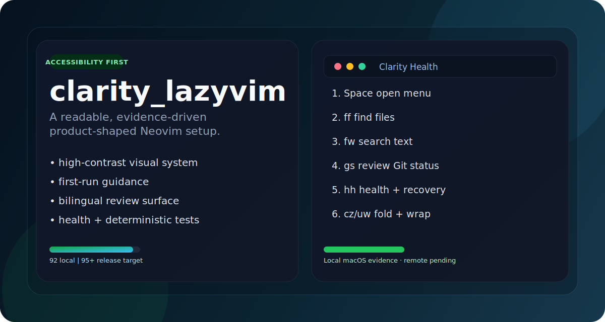
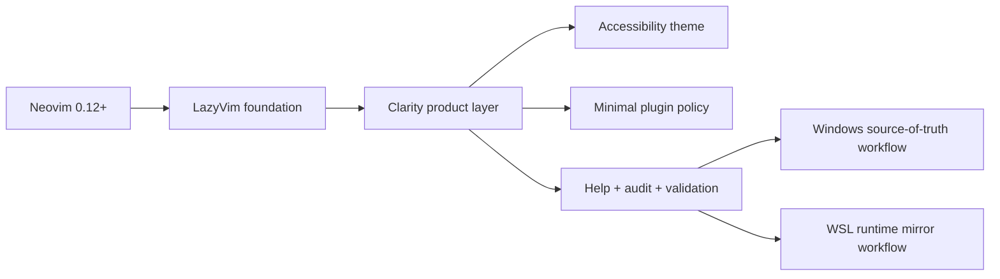

# clarity_lazyvim

<p align="center">
  
</p>

<p align="center">
  <a href="https://github.com/Nongfsq/clarity_lazyvim/actions/workflows/clarity-validate.yml">
    
  </a>
  
  
  
  <a href="LICENSE">
    
  </a>
</p>

<p align="center">
  An accessibility-first, high-contrast, product-shaped Neovim distribution built on <a href="https://www.lazyvim.org/">LazyVim</a>.
</p>

<p align="center">
  Designed for people who want the speed of Neovim without the usual plugin sprawl, shell coupling, or "I updated it and nothing changed" confusion.
</p>

## Why Clarity

Most personal Neovim repos are powerful but hard to trust.

`clarity_lazyvim` takes a different position:

- readability is a product feature, not a theme afterthought
- one recommended path is better than five clever ones
- optional tools stay optional
- Windows + WSL workflows should be explicit, not tribal knowledge
- validation matters as much as visual polish

This repo is not an `oh-my-zsh` bundle, not a shell framework, and not a maximalist plugin showcase.
It is a focused editor product for daily work.

## What You Get

| Area | Primary path | Why it matters |
| --- | --- | --- |
| File search | `<leader>ff` | Fast project entry without depending on file trees for everything |
| Text search | `<leader>fw` | One obvious search path backed by Snacks picker |
| Terminal | `<leader>tf` | Reliable integrated terminal workflow inside the editor |
| Git hunks | `<leader>hs`, `<leader>hr`, `<leader>hp` | Clear hunk ownership without overloading the global Git namespace |
| Recovery | `:ClarityStart`, `<leader>hh` | A product-level "I forgot" path inside Neovim |
| Language | `:ClarityLanguage` | Switch Clarity-owned UI between `auto`, `en`, and `zh` |
| Audit | `:ClarityAudit` | Environment and dependency readiness in one command |
| Validation | `:ClarityValidate` | Behavior checks, not just "is the binary installed?" |

## Product Highlights

### Accessibility-first visual system

The custom theme is built around strong contrast, clearer syntax separation, and better readability for red-green colorblind users.

### Curated plugin surface

The active stack stays intentionally small:

- LazyVim core
- Snacks picker
- `neo-tree.nvim`
- `toggleterm.nvim`
- `gitsigns.nvim`
- `conform.nvim`
- `nvim-treesitter`
- `copilot.lua`

Several inherited or optional power-user plugins are deliberately disabled to keep the public product easier to audit and maintain.

### First-run guidance that actually helps

The first empty interactive startup opens a welcome guide automatically once per onboarding version.
It teaches the top actions, points users to clipboard help, and explains how to recover from stale configs.

### Bilingual runtime with English source governance

Clarity now separates maintainer surfaces from product surfaces on purpose:

- source comments stay English-only for long-term maintainability
- Clarity-owned runtime UI can render in English or Chinese
- the locale is controlled with `:ClarityLanguage auto|en|zh`

Version one localizes Clarity-owned help panels, key descriptions, notifications, command descriptions, and the inherited `<leader>` menu hints shown by `which-key`.
It does not attempt to rewrite every upstream plugin UI.

### Terminal-first stability defaults

Clarity now prefers a steadier terminal experience over extra motion or decorative status rendering:

- faster leader-menu response with a lower `timeoutlen`
- no smooth scrolling in terminal workflows
- no invisible-character markers by default
- no custom `statuscolumn` in normal editing buffers

The goal is simple: typing, vertical movement, and window motion should feel stable before they feel fancy.

### Windows + WSL workflow discipline

The project documents and supports a simple operational rule:

1. Windows repo is the source of truth for edits, commits, and pushes.
2. WSL repo is the runtime mirror.
3. If WSL behavior looks old, compare `HEAD` before debugging anything else.

### Built-in trust layer

This repo ships with:

- `:ClarityAudit`
- `:ClarityValidate`
- headless validation scripts
- GitHub Actions CI

That makes the project feel more like a product than a bag of config files.

## Quick Start

### Windows

Clone into `%LOCALAPPDATA%\nvim`:

```powershell
git clone https://github.com/Nongfsq/clarity_lazyvim.git $env:LOCALAPPDATA\nvim
```

### Linux / WSL / macOS

Clone into `~/.config/nvim`:

```sh
git clone https://github.com/Nongfsq/clarity_lazyvim.git ~/.config/nvim
```

### First launch

```sh
nvim
```

On first launch:

1. `lazy.nvim` bootstraps plugins.
2. Mason installs configured language servers and formatter tooling.
3. Treesitter compiles parsers if a compiler is available.
4. Copilot prefers a Node.js `22+` runtime.
5. The Clarity welcome panel appears automatically on the first empty interactive startup.
6. Use `:ClarityLanguage auto|en|zh` any time to inspect or change the Clarity UI language.

## First 5 Minutes

If you only remember one workflow, remember this:

1. Press `Space` and pause to open `which-key`.
2. Use `<leader>ff` to find files.
3. Use `<leader>fw` to search project text.
4. Use `<leader>e` when you want the file tree.
5. Use `<leader>tf` for the floating terminal.
6. Use `gd`, `gr`, and `gl` to navigate code and diagnostics.
7. Reopen help any time with `:ClarityStart` or `<leader>hh`.

## Architecture



### Dependency strategy

The project follows five hard rules:

1. Shell frameworks such as `oh-my-zsh` are not runtime foundations.
2. Optional tools must degrade gracefully.
3. Formatter and provider requirements must be documented.
4. The source of truth for plugin versions is the root [`lazy-lock.json`](lazy-lock.json).
5. Source comments stay English-only; Clarity-owned runtime UI may localize to English or Chinese.
6. Public docs describe public behavior; local AI planning files stay out of the repo.

## Tech Stack

<p>
  
  
  
  
  
  
  
  
  
  
</p>

## Verified Baseline

Current validated baseline:

- Windows authoring environment: `94/100`
- WSL runtime environment: `100/100`
- Required validation checks: passing

That does not mean Windows is broken.
It means a few optional tools such as `fd` and `htop` / `btop` are still missing on the current authoring machine.

## Validation

Inside Neovim:

```vim
:ClarityAudit
:ClarityValidate
```

From the terminal:

```powershell
python scripts/run_clarity_audit.py
python scripts/run_clarity_validate.py
```

Minimal smoke test:

```powershell
nvim --headless -u .\init.lua "+qall"
```

Validation currently covers:

- startup smoke checks on Windows and WSL
- keymap assertions for high-frequency paths
- dashboard, `neo-tree`, and terminal UI behavior
- clipboard, Python, Node, and Copilot provider readiness

## Prerequisites

### Required

1. Neovim `0.12+`
2. Git
3. A C compiler for Treesitter
4. A Nerd Font

### Recommended

1. `ripgrep`
2. `fd`
3. Node.js `22+` and npm
4. Python and pip

### Optional

1. `htop` or `btop`

## Troubleshooting

### Search mentions Telescope

This config expects the Snacks picker.
If `<leader>ff` or `<leader>fw` mentions Telescope, you are almost certainly running stale config.

Run:

1. `:ClaritySync`
2. compare `git rev-parse --short HEAD` between Windows and WSL
3. restart Neovim after pull

### Clipboard feels inconsistent in WSL

Use `:ClarityClipboard`.

It explains the difference between:

- terminal copy
- Neovim yank
- explicit system clipboard copy such as `"+y`

### Language changed but some labels still look old

`:ClarityLanguage` saves the new choice immediately.

Some command menus and key descriptions are registered during startup, so restart Neovim after switching languages if you want a full refresh.

### Typing or vertical movement feels laggy

Current defaults are tuned for terminal stability.

If motion still feels stale after an update:

1. make sure Windows and WSL are on the same commit
2. fully restart Neovim instead of reusing an old running instance
3. if needed, compare `git rev-parse --short HEAD` in Windows and WSL before debugging plugins

If you previously saw a stray `|` while moving, that was most likely terminal rendering noise from visual options that Clarity now disables by default.

### `:ClarityAudit` reports missing optional tools

That is expected when optional extras are not installed.
The related features warn and degrade gracefully instead of crashing the editor.

### Copilot says Node.js `22+` is required

Install a modern Node runtime with `fnm`, `nvm`, or `volta`.
When `fnm` is present, Clarity prefers the newest `fnm`-managed Node automatically before falling back to `PATH`.

## Documentation

- Chinese complete guide: [doc/clarity_lazyvim_complete_guide_zh.md](doc/clarity_lazyvim_complete_guide_zh.md)
- Product evaluation and architecture report: [doc/clarity_architecture_governance.md](doc/clarity_architecture_governance.md)

## Project Structure

```text
.
├── .github/
│   └── workflows/
│       └── clarity-validate.yml
├── doc/
│   ├── assets/
│   ├── clarity_architecture_governance.md
│   └── clarity_lazyvim_complete_guide_zh.md
├── nvim/
│   ├── colors/
│   ├── lua/
│   │   ├── config/
│   │   └── plugins/
│   └── init.lua
├── scripts/
│   ├── run_clarity_audit.py
│   └── run_clarity_validate.py
├── init.lua
└── lazy-lock.json
```

## License

MIT. See [LICENSE](LICENSE).
