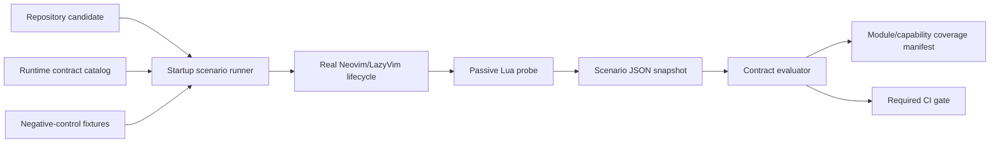

# Architecture Blueprint: Clarity Runtime Contract Verification

Date: 2026-07-09
Architecture type: existing-system verification architecture
Status: historical approved blueprint; local implementation followed; current
truth is in `docs/ai/current-reality.md` and the active PLAN+TASK

## Summary

- Product goal: make repository automation responsible for runtime correctness,
  leaving the owner to judge a small set of visual and subjective experience
  qualities rather than manually discovering broken configuration.
- Architecture type: an incremental verification layer for the existing
  Neovim/LazyVim runtime; it supplements the approved 95+ refactor blueprint.
- Selected stack: Neovim/Lua runtime probes, Python orchestration, copied
  candidate repositories, isolated XDG roots, JSON evidence, and the existing
  GitHub Actions platform matrix.
- Primary constraints: LazyVim retains lifecycle ownership; tests must observe
  real startup instead of manufacturing lifecycle events; no test may mutate the
  live user session or repository authority files; local success is not
  cross-platform release evidence.
- Non-goals: exhaustive testing of every inherited LazyVim feature, screenshot
  automation for all terminal combinations, a new test framework, plugin surface
  expansion, or replacing final human judgment about visual taste.

### Evidence Behind This Blueprint

- The repository currently has 10 modules under `nvim/lua/config/`, 10 modules
  under `nvim/lua/plugins/`, and about 3,533 lines across those two surfaces.
- The Lua unit layer currently contains one 34-line policy test. Python tests
  primarily cover runner utilities, platform resolution, doctor behavior, and
  lock transactions rather than Lua lifecycle ownership.
- The runtime validator emits 51 checks in the current local branch, but 18 are
  locale checks and there is no coverage gate requiring every new config module
  to declare and prove its load phase.
- `scripts/run_clarity_validate.py` explicitly replays `User VeryLazy` in five
  subprocess paths. `config.audit` and `config.validation` also replay it. This
  can load state that real startup missed and therefore create a false pass.
- The current smoke proves canonical paths, two stable boots, 27 resolved
  plugins, and unchanged authority hashes. It does not prove config-module
  loading, lifecycle timing, option ownership, autocmd idempotence, or mapping
  ownership.
- The line-number regression demonstrated the failure mode: real file startup
  left `config.options` unloaded, while validation later replayed `VeryLazy` and
  observed keymaps that had not existed at the original lifecycle boundary.
- Several plugin modules directly call an upstream plugin's `setup()`; the
  approved refactor already identifies those ownership risks, but the present
  suite has no general resolved-spec ownership gate.

## Decisions

- Runtime foundation: keep Neovim, lazy.nvim, and LazyVim unchanged; add a
  contract observer around their real lifecycle. Why: the defect is missing
  evidence, not a need for another runtime. Rejected: a custom Clarity loader
  (would replace LazyVim ownership and create more lifecycle risk). Revisit when:
  two supported LazyVim generations expose no observable lifecycle contract.
- Contract source of truth: add one test-owned Lua contract catalog that lists
  expected modules, phases, promoted options, mappings, commands, plugin
  ownership, and scenarios. Why: new product behavior becomes reviewable and an
  unclassified module fails coverage. Rejected: infer all intent from filenames
  or README prose (cannot distinguish eager, lifecycle, on-demand, and optional
  modules); duplicate per-script expectations (drift). Revisit when: runtime
  modules expose stable machine-readable metadata without increasing product
  coupling.
- Lifecycle observation: wait for naturally emitted lifecycle events and record
  them; never fire `VeryLazy`, `VimEnter`, `BufEnter`, or `FileType` merely to
  make the inspected runtime complete. Why: the check must observe the same
  sequence a user receives. Rejected: `doautocmd User VeryLazy` in validators
  (changes the subject under test and masks missing loads). Revisit when: an
  upstream event is explicitly documented as a repeatable public operation.
- Startup coverage: require a scenario matrix for empty, file, directory, stdin,
  symlink/arbitrary checkout, clean first boot, and offline restart. Why:
  LazyVim chooses different autocmd timing based on startup arguments and UI
  presence. Rejected: one empty headless boot (misses file/directory branches);
  one developer-cache boot (masks installation and state assumptions). Revisit
  when: the supported distribution or invocation model changes.
- Runtime provenance: record both final values and ownership evidence for
  product-critical state. Why: a mapping or option with the correct value but
  the wrong owner can disappear on the next upstream change. Rejected:
  existence-only checks (the false-green pattern seen here); full Lua source
  tracing (fragile and unnecessary). Revisit when: Neovim exposes stronger
  stable provenance APIs for every relevant object.
- Behavior coverage: automate promoted user jobs and high-risk ownership seams,
  not every inherited command. Why: the product promises a small daily core and
  Clarity should test what it markets or overrides. Rejected: exhaustive
  inherited LazyVim testing (unbounded duplication); pure existence testing
  (does not prove behavior). Revisit when: the promoted product surface changes.
- Mutation safety: hash repository authority files before and after every
  scenario, use disposable buffers/windows for behavior probes, and serialize
  session state around in-editor diagnostics. Why: tests and normal diagnostics
  must not repair or rewrite the state they inspect. Rejected: one final Git
  diff check only (poor attribution); running release smoke against the live
  checkout (already caused lock normalization). Revisit when: Clarity adopts a
  read-only packaged runtime.
- Negative controls: every critical contract must have at least one fault
  injection proving that the test becomes red when its target is broken. Why:
  passing tests are not evidence if the same defect can still pass. Rejected:
  relying only on historical regressions (not repeatable). Revisit when:
  mutation testing becomes too slow for PR CI; retain a scheduled/full tier.
- Data/persistence: repository files are read-only inputs during checks;
  candidate config/data/state/cache roots and artifacts have single ownership by
  the test process and are deleted or uploaded after completion. Why: user state
  is not test data. Rejected: shared developer cache as a fixture (order and
  contamination risk). Revisit when: a formal cached CI artifact has a versioned
  immutable contract.
- API/contracts: each check emits stable ID, scenario, phase, owner, expected,
  actual, severity, repair, and evidence source in JSON. Why: failures must name
  the broken boundary rather than present a monolithic log. Rejected: boolean
  pass/fail only (not diagnosable); prose-only logs (not aggregatable). Revisit
  when: a versioned external test-report schema is adopted.
- Testing: use static contract checks, pure Lua/Python unit tests, isolated
  startup contracts, behavior fixtures, and platform release smoke. Why: each
  layer catches a different defect at the cheapest reliable boundary. Rejected:
  E2E-only (slow and hard to localize); unit-only (cannot prove LazyVim
  lifecycle). Revisit when: measured suite duration exceeds the CI budget and a
  lower layer demonstrably replaces an expensive scenario.
- CI/CD and distribution: run fast static/unit contracts on every change and the
  startup/behavior matrix on Ubuntu, Windows, and macOS before release. Why: a
  Git checkout is the product artifact. Rejected: local-only certification;
  allowing a platform job to be optional while retaining its support claim.
  Revisit when: platform scope or distribution packaging changes.
- Observability: publish per-scenario JSON plus a coverage manifest mapping
  modules and promoted capabilities to tests. Why: reviewers can see both
  failures and untested areas. Rejected: a single readiness score (coverage gaps
  disappear inside it). Revisit when: artifacts become too large; retain the
  manifest and summarize raw logs.
- Security: probes run with isolated roots, bounded timeouts, no secrets, and no
  automatic live repair. Why: Neovim configuration executes with developer
  privileges. Rejected: testing with real provider credentials or user files
  (privacy and mutation risk). Revisit when: a separately approved integration
  environment exists.
- Documentation: the contract catalog is technical authority; public docs state
  promoted behavior; the active plan owns implementation status. Why: intent,
  mechanics, and status change at different rates. Rejected: embedding volatile
  coverage counts in marketing. Revisit when: docs are generated from the
  contract catalog.

## System Shape

### Runtime Surfaces

### Module Boundaries

- Contract catalog: expected product state and classification only; no runtime
  mutation.
- Scenario runner: candidate copying, isolated roots, supported invocations,
  timeouts, environment control, source hashes, and artifact collection.
- Passive probe: reads `package.loaded`, naturally observed events, options,
  maps, commands, autocmds, resolved plugin specs, windows, and buffers.
- Evaluator: compares snapshots with the catalog and produces stable checks and
  coverage. It does not start or modify Neovim.
- Behavior fixtures: disposable Git repository, code buffers, missing-tool PATH,
  terminal, small UI, and parser fixtures.
- In-editor diagnostics: passive read model plus UI adapter; any active behavior
  probe belongs in an isolated subprocess, not the user's session.

### Contract Catalog

Every Clarity-owned config module must be classified as one of:

- `pre_plugin`: must load before LazyVim resolves plugin initialization;
- `lifecycle`: must load exactly once through a named natural LazyVim/Neovim
  event;
- `eager_service`: product service intentionally loaded during bootstrap;
- `on_demand`: loads only after its documented command/plugin trigger;
- `test_only`: never part of product runtime.

Every promoted capability must declare:

- user job and public command/mapping;
- owning module or upstream owner;
- startup scenarios in which it must be ready;
- final-state contract and one behavior contract;
- required/optional profile;
- allowed session or filesystem mutations;
- platform scope.

The coverage evaluator fails when a new `config/*.lua` or promoted capability is
not represented, when a module appears in an unexpected phase, or when a
required behavior has no executable check.

### Startup Scenario Matrix

| Scenario | Invocation shape | Primary contract |
| --- | --- | --- |
| Empty headless | no file arguments, isolated roots | bootstrap, options, eager services, natural deferred lifecycle |
| File startup | tracked real file argument | options/autocmds/keymaps before first user action; Git attachment |
| Directory startup | repository directory argument | exactly one Neo-tree, no Snacks Explorer, normal editing state |
| Stdin startup | `nvim -` with fixture text | stream buffer behavior without explorer/help interference |
| Arbitrary checkout | copied candidate outside config path | explicit root authority and nested runtime discovery |
| Symlink config | config path resolves through a symlink | repository identity, authority paths, no duplicate runtime |
| Clean first boot | empty data/cache/state with network enabled | locked plugin installation and stable authority files |
| Offline restart | first-boot state reused with network disabled | no hidden network/bootstrap dependency |
| Attached UI | embedded Neovim with a small attached UI | interactive-only welcome/help behavior at 60x16 and 80x24 |

The attached-UI scenario may run in the full CI tier through `pynvim`; core
headless contracts must not depend on a locally installed optional provider.

### Passive Snapshot

Each scenario records:

- canonical repository, lock, and LazyVim JSON paths and pre/post hashes;
- Neovim, LazyVim, lazy.nvim, and platform versions;
- config modules loaded, load count, and observed lifecycle phase;
- natural lifecycle event counts; no event is replayed by the probe;
- critical global/window/buffer options and final values;
- promoted maps: mode, lhs, description, callback/function shape, buffer scope,
  and declared owner;
- Clarity commands and descriptions;
- Clarity autocmd groups, event/pattern, count, and idempotence;
- resolved plugin specs, enabled state, event/cmd/keys, final opts, and lifecycle
  owner classification;
- current windows/buffers/filetypes for directory/dashboard/help scenarios;
- warnings/errors and bounded startup timing.

### Automated Versus Human Responsibility

Automation owns:

- module discovery and correct load phase;
- startup without error in every supported scenario;
- option/map/command/autocmd/plugin ownership contracts;
- fold, wrap, explorer, search, terminal, Git, formatter, parser, help-state,
  and diagnostic state behavior where deterministic;
- zero authority-file drift and session restoration;
- missing dependency, offline, and failure-cleanup behavior;
- platform reproducibility and coverage completeness.

The project owner owns only:

- whether color, spacing, typography, animation, and terminal rendering feel
  good on representative real terminals;
- whether the promoted workflow names and help copy are understandable;
- whether perceived latency and interaction rhythm meet the product taste bar.

Human findings become reproducible fixtures whenever they describe deterministic
behavior. The owner is never asked to re-test the whole feature surface after
each change.

## Scaffold Plan

Only proposed implementation paths are listed; no scaffold is created at this
architecture gate.

- `tests/contracts/runtime_contract.lua`: single expected-state catalog for
  modules, phases, promoted capabilities, scenarios, profiles, and ownership.
  Validation: contract schema/unit tests and unclassified-file drift check.
- `tests/lua/runtime_probe.lua`: passive runtime snapshot collector with no
  lifecycle replay. Validation: self-test against minimal fixture state.
- `scripts/run_clarity_contracts.py`: scenario orchestration, candidate copy,
  isolated roots, timeout, JSON extraction, evaluation, and coverage manifest.
  Validation: Python unit tests plus one real file-start vertical slice.
- `tests/python/test_runtime_contracts.py`: catalog parsing, scenario command
  construction, coverage failure, hash drift, timeout, and negative controls.
- `tests/fixtures/runtime/`: small tracked file, directory, stdin, Git, missing
  executable, offline, and failure-injection fixtures; never user data.
- `artifacts/runtime-contracts/`: CI-only scenario snapshots, coverage manifest,
  environment manifest, and bounded failure logs.
- `scripts/run_clarity_validate.py`: shrink toward product-level behavior checks;
  remove lifecycle replay and delegate startup correctness to the contract
  runner. Validation: existing check IDs migrated or explicitly retired.
- `nvim/lua/config/{audit,validation}.lua`: passive inspection only; active UI
  probes move to subprocess fixtures. Validation: repeat invocation and complete
  session-state equality.
- `.github/workflows/clarity-validate.yml`: fast contract job plus platform
  scenario/behavior artifacts. Validation: Actionlint and required remote matrix.
- `docs/decisions/`: add the adopted runtime-contract ADR only when execution is
  approved and begins.

## Migration and Rollout

- Current state to target state: move from a monolithic validator that can
  manufacture lifecycle completeness to a passive contract runner that proves
  natural startup, ownership, behavior, mutation safety, and coverage.
- Stage 1 — evidence freeze: preserve current check IDs and capture which checks
  replay events, mutate windows, depend on developer cache, or lack ownership.
  Gate: a machine-readable legacy-to-target check map exists.
- Stage 2 — first vertical slice: reproduce the line-number failure by hiding the
  nested runtime path in a copied candidate. The new file-start contract must
  fail on unloaded `config.options`, wrong relative numbering, missing autocmds,
  and wrong module phase, then pass with the runtime-path fix. Gate: negative and
  positive evidence both pass.
- Stage 3 — startup matrix: add empty, directory, stdin, arbitrary checkout,
  symlink, clean boot, and offline restart. Gate: no unclassified config module,
  duplicate event, startup error, or authority drift.
- Stage 4 — promoted behaviors: migrate explorer, fold/wrap, search, terminal,
  Git, formatting, parser, and help checks into disposable fixtures with owner
  assertions. Gate: every promoted capability has final-state and behavior
  evidence.
- Stage 5 — passive diagnostics: remove all production `VeryLazy` replay and
  prove audit/validation repeatability and session restoration. Gate: serialized
  before/after session state is identical on success and injected failure.
- Stage 6 — platform release gate: run the required scenario and behavior set on
  Ubuntu, Windows, and macOS, plus attached-UI checks in the full tier. Gate:
  commit-bound artifacts and no support claim without a green platform job.
- Compatibility window: preserve public commands and stable check IDs during
  migration; where semantics change, emit both legacy and new fields for one
  implementation phase, not indefinitely.
- Data migration: N/A — no application datastore. Test artifacts are ephemeral;
  user config/data/state/cache remains untouched.
- Rollback: each stage is a separate reviewable commit. Revert the stage and
  retain the previous validator until the replacement has positive and negative
  evidence parity.
- Kill switch: the new runner can remain non-blocking for one PR while evidence
  is compared, but it becomes required before removing the corresponding legacy
  check. Required release gates never downgrade silently.
- Rollback signals: false green against an injected defect, source/hash mutation,
  user-session mutation, nondeterministic scenario output, unexplained platform
  divergence, or CI duration beyond the agreed budget.

## Implementation Sequence

- Foundation: define the contract schema, catalog validation, passive snapshot
  schema, scenario runner, artifact layout, and legacy-check mapping.
- First vertical slice: file startup and the exact nested-runtime/relative-line
  regression, including a negative control. This exercises the riskiest decision:
  observing natural LazyVim lifecycle without replaying it.
- Hardening: complete startup matrix, module coverage, option/map/autocmd/plugin
  ownership, promoted behavior fixtures, session restoration, offline restart,
  and attached UI.
- Launch gates: zero unclassified modules/capabilities, every critical negative
  control detects its fault, local static/unit/integration green, remote required
  platform matrix green, and artifacts bound to the exact commit.

## Verification

- Unit/component tests: contract schema, module classification, scenario command
  generation, platform paths, timeout, JSON parsing, hash drift, session
  serialization, and coverage calculations.
- API/contract tests: contract-catalog completeness against `config/*.lua` and
  promoted capability inventory; stable output schema; resolved plugin ownership
  and opts; legacy-to-target check-ID mapping.
- Integration/E2E tests: natural empty/file/directory/stdin/symlink startup,
  clean first boot, offline restart, attached small UI, and deterministic promoted
  behavior fixtures.
- Negative controls: missing nested runtime path; hidden options module; duplicate
  `VeryLazy`; correct-LHS/wrong-owner mapping; upstream default overriding a
  Clarity option; duplicate explorer; authority-file write; failed diagnostic
  cleanup. Each must fail the intended stable check ID.
- Build/type/lint checks: StyLua, Lua compile/load check, Ruff, Python unit tests,
  Actionlint, JSON schema/parse, Markdown link/path check, and `git diff --check`.
- Deployment smoke: N/A — distribution is a Git checkout. Release smoke is the
  clean candidate plus offline restart on the required platform matrix.
- Observability checks: every failure artifact contains scenario, phase, owner,
  expected/actual, repair, versions, hashes, and bounded logs; coverage manifest
  has zero unclassified required entries.

## ADRs to Write

- ADR: Natural-lifecycle runtime contracts. Context/decision: observe real
  LazyVim/Neovim events through a passive scenario matrix and forbid validators
  from replaying lifecycle events. Rejected: manufactured `VeryLazy` completeness
  and empty-headless-only smoke. Revisit when: upstream lifecycle contracts
  fundamentally change or a packaged runtime replaces clone startup.
- ADR: Product capability coverage ownership. Context/decision: one test-owned
  catalog classifies every Clarity config module and promoted capability and
  fails on unclassified drift. Rejected: README inference and scattered mirrored
  expectations. Revisit when: equivalent metadata becomes a stable runtime source
  of truth.

## Risks And Assumptions

- Risks: an over-broad contract can couple tests to harmless upstream details;
  attached-UI automation adds complexity; complete platform scenarios increase
  CI time; current monolithic validation must be migrated without losing stable
  diagnostics; existing direct plugin setup ownership may generate multiple
  failures before its scheduled refactor tasks are complete.
- Mitigations: assert only Clarity-owned or publicly promoted state; keep
  upstream internals observational and version-bounded; split fast PR and full
  release tiers; preserve legacy checks until replacement negative controls pass;
  classify known future migration failures explicitly without marking them
  release-ready.
- Assumptions: LazyVim remains the foundation; Neovim 0.12.4 remains the current
  pinned CI runtime; root-wrapper plus nested runtime remains supported; Copilot
  and providers remain optional; promoted daily-core actions remain the initial
  behavior scope.
- Revisit triggers: supported Neovim/LazyVim generation changes; CI runtime
  exceeds the agreed budget; a packaged distribution replaces repository clone;
  product research changes the promoted capability surface; Neovim adds stable
  built-in provenance/contract APIs that replace custom snapshot fields.

## Handoff

- Assumptions with stated defaults: fast contract/unit checks run on every PR
  (default: required); full platform/attached-UI tier runs before release
  (default: required); deterministic human findings become regression fixtures
  (default: yes); inherited non-promoted LazyVim features remain upstream's test
  responsibility (default: yes).
- Open questions: zero blocking. Non-blocking: exact attached-UI transport
  (default: `pynvim` only in the full CI tier); exact CI time budget (default: 10
  minutes static/contracts and 20 minutes per platform runtime job, matching the
  current workflow bounds).
- Non-goals: exhaustive upstream testing, visual snapshotting of every terminal,
  new plugins, telemetry, destructive user-state tests, or weakening gates to
  preserve a green badge.
- Status line: blueprint written to
  `docs/architecture/2026-07-09-runtime-contract-verification-blueprint.md`;
  natural-lifecycle observation, contract catalog, scenario matrix, negative
  controls, and human/automation boundaries await approval. Recommended next
  step: approve this blueprint, then use PM planning to add dependency-ordered
  tasks to the active refactor plan before implementation.
